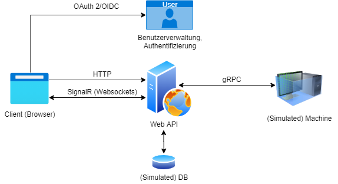

# .NET Core Microservices Sample

This project consists of multiple (micro-)services based on .NET 5. It's part of a consulting workshop and free to use.

## General

This sample is a simplified abstraction of a *machine visualization* based on a sample machine implementation (simulated via a console application), an ASP.NET Core REST service backend and a HTML frontend. For demonstration purposes an additional OpenID Connect/OAuth 2 user authorization is included in the REST backend.

## User Flow / Program Flow

* User logs in into the system
* The UI is loading the available machines and displays them
* The user can select one of the available machines for further details
* Afterwards the machine visualization (in our sample SVG) and some machine specific data (settings, switches) is loaded and displayed
* The used can directly interact with settings and switches in the displayed machine visualization

## Technologies

The following technologies should be demonstrated:

* OAuth 2, OpenID Connect, JWT, ASP.NET JWT Middleware
* ASP.NET (Web API) and the Open API Specification (Swagger)
* gRPC, ASP.NET gRPC
* .NET in Docker/K8s
* SignalR
* TypeScript 

## Project architecture

## Overall project folder structure

The following (sub-)projects are part of this sample:

* [ASP .NET project](NetCoreMicroserviceSample/NetCoreMicroserviceSample.Api) with API controllers and REST service endpoints
* [gRPC machine simulation](NetCoreMicroserviceSample/NetCoreMicroserviceSample.Machine) as remote machine data service
* [HTML5 web frontend](NetCoreMicroserviceSample/NetCoreMicroserviceSample.UserInterface) as simple 2D HMI frontend

## Notes

Project is built with [GitHub Actions](.github/workflows).
